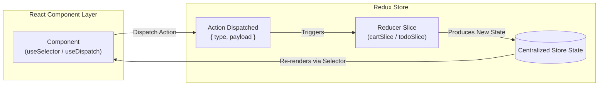
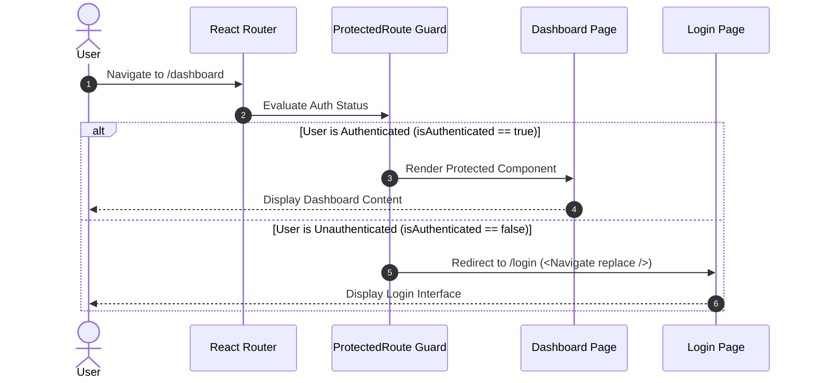

# ⚛️ React & Full-Stack Development Coursework & Lab Repository

<div align="center">


<p align="center">
  A comprehensive, hands-on repository containing structured lab exercises, modular projects, continuous assessments (CIA), and full-stack implementations spanning modern React 19, Redux Toolkit, React Router, Custom Hooks, Tailwind CSS v4, and MERN CRUD architecture.
</p>

[Explore Modules](#-curriculum--directory-structure) •
[Quick Start](#-quick-start--installation) •
[Architecture Diagrams](#-architectural-patterns--flows) •
[Tech Stack](#-technology-stack)

---

</div>

## 📖 Table of Contents

- [Overview](#-overview)
- [Curriculum & Directory Structure](#-curriculum--directory-structure)
  - [1. React Core & Fundamentals](#1-react-core--fundamentals)
  - [2. Forms & Controlled Components](#2-forms--controlled-components)
  - [3. Custom Hooks & Advanced Logic](#3-custom-hooks--advanced-logic)
  - [4. Global State Management (Redux Toolkit)](#4-global-state-management-redux-toolkit)
  - [5. Client-Side Routing & Authentication](#5-client-side-routing--authentication)
  - [6. Data Fetching & Async Operations](#6-data-fetching--async-operations)
  - [7. Full-Stack MERN CRUD Application](#7-full-stack-mern-crud-application)
  - [8. Continuous Assessment & Practicals](#8-continuous-assessment--practicals)
- [Architectural Patterns & Flows](#-architectural-patterns--flows)
  - [Redux Toolkit State Flow](#1-redux-toolkit-state-flow)
  - [Protected Route & Auth Guard Flow](#2-protected-route--auth-guard-flow)
  - [Full-Stack CRUD Client-Server Flow](#3-full-stack-crud-client-server-flow)
- [Technology Stack](#-technology-stack)
- [Quick Start & Installation](#-quick-start--installation)
  - [Prerequisites](#prerequisites)
  - [Running Any Frontend Project](#running-any-frontend-project)
  - [Running the Full-Stack CRUD Application](#running-the-full-stack-crud-application)
- [Code Standards & Best Practices](#-code-standards--best-practices)
- [License & Acknowledgements](#-license--acknowledgements)

---

## 🚀 Overview

This repository documents the learning trajectory and practical implementations for modern **React.js web development** and **Full-Stack MERN applications**. Each folder represents an isolated, self-contained lab or project designed to demonstrate focused concepts—from basic JSX and props drilling to enterprise-grade state management with Redux Toolkit and REST API integrations.

### Key Highlights
- ⚡ **Modern Tooling:** Powered by Vite 8+ for rapid HMR (Hot Module Replacement) and optimized bundling.
- 🎨 **Next-Gen Styling:** Modern styling utilizing Tailwind CSS v4 and modular CSS.
- 📦 **State Architecture:** Local state (`useState`), custom hook abstraction (`useTheme`), and global state slices (`@reduxjs/toolkit` + `react-redux`).
- 🛡️ **Authentication & Routing:** Protected client routes, declarative navigation layouts, and dynamic URL handling with React Router DOM.
- 🌐 **Full-Stack Integration:** Complete client-server communication using Axios, Express 5, and Mongoose for MongoDB.

---

## 📂 Curriculum & Directory Structure

```text
react-class/
├── 18usestate/          # useState Hook, Counter & Interactive Toggle components
├── 21forms/             # Controlled Form Inputs, Validation & State Sync
├── 24labs/              # Tailwind CSS + React Router integration
├── 25labs-7/            # Protected Routes, Auth state & Dashboard access control
├── 27lab/               # Data Fetching strategies (fetch, axios, async/await)
├── 29crud/              # Full-Stack CRUD application (Node/Express + React frontend)
│   ├── backend/         # Express REST API server with Mongoose & CORS
│   └── frontend/        # React client with Axios CRUD operations
├── cia/                 # Continuous Internal Assessment / Practical exams
├── controlled_cp/       # Controlled vs Uncontrolled form components
├── event_handling/      # Synthetic Events, Mouse/Keyboard/Input handlers
├── lab9/                # Custom React Hooks (e.g., useTheme dark/light mode)
├── lab10/               # Redux Toolkit Shopping Cart (cartSlice, store)
├── props07/             # Props Passing, Parent-Child-Grandchild tree & Destructuring
├── reduxidk/            # Redux Toolkit Todo Application (todoSlice, Store)
├── routing/             # React Router DOM fundamentals (BrowserRouter, NavLink, Routes)
├── routing_pb/          # Page-based layout routing (Header, Footer, Services)
├── routinglab/          # Modular routing with dedicated page components & layouts
└── vite-project/        # Baseline React + Vite project setup
```

---

### 1. React Core & Fundamentals

| Project Folder | Primary Concepts Covered | Key Components / Files |
| :--- | :--- | :--- |
| [`vite-project`](./vite-project) | Project scaffolding, Vite configuration, JSX structure | `src/App.jsx`, `src/main.jsx` |
| [`props07`](./props07) | Props passing, unidirectional data flow, component hierarchies | `parent.jsx`, `child.jsx`, `grandchild.jsx` |
| [`18usestate`](./18usestate) | Local state management, re-rendering triggers, state mutation avoidance | `App.jsx`, `button.jsx`, `displaybtn.jsx` |
| [`event_handling`](./event_handling) | Synthetic event listeners, event propagation, button & input events | `src/App.jsx` |

### 2. Forms & Controlled Components

| Project Folder | Primary Concepts Covered | Key Components / Files |
| :--- | :--- | :--- |
| [`controlled_cp`](./controlled_cp) | Controlled vs uncontrolled components, input synchronization | `src/App.jsx` |
| [`21forms`](./21forms) | Form submission handling, multi-field inputs, reset handling | `src/App.jsx` |

### 3. Custom Hooks & Advanced Logic

| Project Folder | Primary Concepts Covered | Key Components / Files |
| :--- | :--- | :--- |
| [`lab9`](./lab9) | Custom hooks extraction, state reusability, theme switcher hook | `src/hooks/useTheme.jsx`, `src/App.jsx` |

### 4. Global State Management (Redux Toolkit)

| Project Folder | Primary Concepts Covered | Key Components / Files |
| :--- | :--- | :--- |
| [`lab10`](./lab10) | Redux Toolkit Store, Reducer Slices, Action Dispatching for Shopping Cart | `src/redux/store.js`, `src/redux/cartSlice.js` |
| [`reduxidk`](./reduxidk) | Redux Store configuration, Todo CRUD state, `useSelector` & `useDispatch` | `src/app/Store.js`, `src/features/todoSlice.js` |

### 5. Client-Side Routing & Authentication

| Project Folder | Primary Concepts Covered | Key Components / Files |
| :--- | :--- | :--- |
| [`routing`](./routing) | Basic routing with `react-router-dom`, `BrowserRouter`, `Routes`, `Route`, `Link` | `navbar.jsx`, `home.jsx`, `about.jsx`, `contact.jsx` |
| [`routinglab`](./routinglab) | Layout wrapping (`Layout`), nested routes, dynamic navigation bar | `components/layout.jsx`, `pages/dashboard.jsx` |
| [`routing_pb`](./routing_pb) | Page-based architecture with Header/Footer layout & Tailwind styling | `components/header.jsx`, `components/footer.jsx` |
| [`24labs`](./24labs) | Modern route layouts combined with Tailwind CSS v4 styling | `src/App.jsx` |
| [`25labs-7`](./25labs-7) | **Protected Routes**, authentication state simulation, restricted dashboard redirect | `login.jsx`, `protected.jsx`, `dashboard.jsx` |

### 6. Data Fetching & Async Operations

| Project Folder | Primary Concepts Covered | Key Components / Files |
| :--- | :--- | :--- |
| [`27lab`](./27lab) | Comparing native `fetch()`, `axios`, and `async/await` with `useEffect` | `fecth.jsx`, `axios.jsx`, `async.jsx` |

### 7. Full-Stack MERN CRUD Application

| Subdirectory | Role | Stack / Features |
| :--- | :--- | :--- |
| [`29crud/backend`](./29crud/backend) | RESTful API Server | Node.js, Express 5, Mongoose (MongoDB ODM), CORS |
| [`29crud/frontend`](./29crud/frontend) | Client Interface | React 19, Vite, Axios HTTP client, CRUD UI |

### 8. Continuous Assessment & Practicals

| Project Folder | Primary Concepts Covered | Key Components / Files |
| :--- | :--- | :--- |
| [`cia`](./cia) | Cumulative Continuous Internal Assessment project synthesizing React skills | `src/App.jsx`, `src/main.jsx` |

---

## 🏛️ Architectural Patterns & Flows

### 1. Redux Toolkit State Flow



### 2. Protected Route & Auth Guard Flow



### 3. Full-Stack CRUD Client-Server Flow

```mermaid
flowchart TD
    Client["React Frontend\n(Axios Client)"]
    Server["Express 5 REST API\n(Node.js Server)"]
    DB[("MongoDB Database\n(Mongoose ODM)")]

    Client -->|POST /items (Create)| Server
    Client -->|GET /items (Read)| Server
    Client -->|PUT /items/:id (Update)| Server
    Client -->|DELETE /items/:id (Delete)| Server

    Server <-->|Schema Validation & Queries| DB
    Server -->|JSON Response| Client
```

---

## 🛠️ Technology Stack

| Category | Technologies |
| :--- | :--- |
| **Frontend Core** | React 19.x, React DOM, JSX, ES6+ JavaScript |
| **Build Tooling & Bundlers** | Vite 8.x, @vitejs/plugin-react |
| **State Management** | Redux Toolkit (`@reduxjs/toolkit`), `react-redux`, React Context & Custom Hooks |
| **Routing & Navigation** | React Router DOM v6+ (`BrowserRouter`, `Routes`, `Route`, `Navigate`) |
| **Styling & UI** | Tailwind CSS v4 (`@tailwindcss/vite`), Custom CSS3, Responsive Design |
| **HTTP & API Communication** | Axios, Native Fetch API, Async/Await |
| **Backend & Database** | Node.js, Express 5.x, MongoDB, Mongoose 9.x, CORS |
| **Code Quality** | ESLint, React Hooks Linter rules |

---

## 🏁 Quick Start & Installation

### Prerequisites

Ensure you have the following installed on your machine:
- **Node.js**: `v18.0.0` or higher (Recommended: `v20.x` or `v22.x`)
- **npm**: `v9.0.0` or higher (or `pnpm` / `yarn`)
- **MongoDB**: Local MongoDB instance (running on `mongodb://localhost:27017`) or a MongoDB Atlas URI (for `29crud` full-stack app)

---

### Running Any Frontend Project

Each lab/folder is a standalone Vite project. You can run any individual module by navigating to its folder and starting the development server:

```bash
# 1. Navigate to the desired module directory (e.g., 25labs-7)
cd 25labs-7

# 2. Install dependencies
npm install

# 3. Start the local development server
npm run dev
```

The application will be accessible at: `http://localhost:5173` (or the port shown in your terminal).

---

### Running the Full-Stack CRUD Application (`29crud`)

The `29crud` project contains both a backend REST API server and a React frontend client.

#### Step 1: Start the Backend Server

```bash
# Navigate to the backend directory
cd 29crud/backend

# Install dependencies
npm install

# Start the Express server
npm start
# Server will run on http://localhost:5000 (or configured port)
```

#### Step 2: Start the Frontend Client (in a separate terminal)

```bash
# Navigate to the frontend directory
cd 29crud/frontend

# Install dependencies
npm install

# Start the Vite dev server
npm run dev
# Frontend will be live on http://localhost:5173
```

---

## 📋 Common npm Scripts

Within any project directory, the following standard scripts are available:

| Command | Description |
| :--- | :--- |
| `npm run dev` | Boots up the Vite local development server with hot-reload |
| `npm run build` | Compiles and optimizes assets into the `dist/` directory for production |
| `npm run preview` | Locally previews the production build output |
| `npm run lint` | Analyzes code for potential errors and adherence to ESLint rules |

---

## 💡 Code Standards & Best Practices

1. **Component Modularity:** Break down UI into single-responsibility, reusable components (e.g., `Header`, `Footer`, `Navbar`, `Button`).
2. **State Immutability:** Never mutate state directly; always use state setter functions or Redux Toolkit's built-in Immer mechanism.
3. **Custom Hooks:** Abstract non-visual stateful logic (like theme switching or local storage synchronization) into custom hook functions prefixed with `use*`.
4. **Declarative Routing:** Maintain clean route declarations and centralize route guards for protected resources.
5. **Separation of Concerns:** Keep API communication (Axios/fetch), business logic (Redux slices), and UI presentation clearly separated.

---

## 📄 License & Acknowledgements

- **Repository:** Created for React class coursework, laboratory assignments, and full-stack web development training.
- **License:** Open for educational and reference purposes.

---

<div align="center">
  <sub>Built with ❤️ using React 19, Vite, Redux Toolkit, Tailwind CSS, and Node.js</sub>
</div>
